# CLAUDE.md

This file provides guidance to Claude Code (claude.ai/code) when working with code in this repository.

## Commands

### Running the Agent
```bash
python -m src.um_agent_coder "YOUR_PROMPT"
```

### Running the 24/7 CLI Harness
```bash
# Default: Run with Codex CLI (gpt-5.2)
python -m src.um_agent_coder.harness --roadmap specs/roadmap.md

# Use Gemini CLI instead
python -m src.um_agent_coder.harness --roadmap specs/roadmap.md --cli gemini

# Use Claude CLI instead
python -m src.um_agent_coder.harness --roadmap specs/roadmap.md --cli claude

# Override model (default per CLI is auto-selected)
python -m src.um_agent_coder.harness --roadmap specs/roadmap.md --cli gemini --model gemini-3-flash

# Dry run - preview execution without running
python -m src.um_agent_coder.harness --roadmap specs/roadmap.md --dry-run

# Run 24/7 daemon mode
python -m src.um_agent_coder.harness --roadmap specs/roadmap.md --daemon

# Check current status
python -m src.um_agent_coder.harness --status

# Reset state and start fresh
python -m src.um_agent_coder.harness --reset
```

### Installing Dependencies
```bash
pip install -r requirements.txt
```

### Configuration
The agent expects a configuration file at `config/config.yaml`. If it doesn't exist, the agent will create a default one. You can also set the `OPENAI_API_KEY` environment variable instead of adding it to the config file.

## Architecture

This is an AI coding agent built with a modular architecture:

1. **Entry Point**: `src/um_agent_coder/__main__.py` -> `main.py`
   - Handles argument parsing and configuration loading
   - Creates LLM provider and Agent instances
   - Executes the agent with the user's prompt

2. **Core Components**:
   - **Agent** (`agent/agent.py`): Main agent class that orchestrates interactions with the LLM
   - **LLM Base** (`llm/base.py`): Abstract base class defining the LLM interface
   - **Config** (`config.py`): Handles YAML configuration loading with dot notation support

3. **LLM Providers**:
   - Located in `llm/providers/`
   - Supports: OpenAI, Anthropic, Google, Claude CLI, Google ADC
   - New providers should inherit from the `LLM` base class

4. **24/7 CLI Harness** (`harness/`):
   - Autonomous task execution via Codex, Gemini, or Claude CLI
   - Supports per-task CLI and model selection
   - Roadmap-driven planning from `specs/roadmap.md`
   - SQLite state persistence for resume capability
   - Growth mode for continuous improvement after completion

5. **Extension Points**:
   - Add new LLM providers by creating a new class in `llm/providers/` that inherits from `LLM`
   - The provider selection is controlled by the `llm.provider` config value

## 24/7 CLI Harness

The harness enables autonomous 24/7 task execution using multiple CLI backends:
- **Codex CLI** (OpenAI/ChatGPT Pro) - gpt-5.2
- **Gemini CLI** (Google) - gemini-3-pro, gemini-3-flash
- **Claude CLI** (Anthropic) - claude-opus-4.5

### Architecture Diagram

```mermaid
flowchart TB
    subgraph Input["📄 Input"]
        RM[specs/roadmap.md<br/>Objectives, Tasks, Dependencies<br/>Per-task CLI/model selection]
    end

    subgraph Harness["🔄 Harness Loop (main.py)"]
        direction TB
        PARSE[RoadmapParser<br/>Parse markdown into tasks]
        NEXT[Get Next Task<br/>Check dependencies]
        SELECT[Select Executor<br/>Per-task CLI override]
        EXEC[Execute Task<br/>Via selected CLI]
        VERIFY[Verify Success<br/>Check criteria]

        PARSE --> NEXT
        NEXT --> SELECT
        SELECT --> EXEC
        EXEC --> VERIFY
    end

    subgraph State["💾 Persistence"]
        DB[(SQLite<br/>.harness/state.db)]
        LOG[harness.log]
    end

    subgraph CLIs["🤖 CLI Backends"]
        CODEX[Codex CLI<br/>gpt-5.2 • reasoning: high]
        GEMINI[Gemini CLI<br/>gemini-3-pro/flash]
        CLAUDE[Claude CLI<br/>claude-opus-4.5]
    end

    subgraph Growth["🌱 Growth Mode"]
        ANALYZE[Analyze Completed Work]
        GEN[Generate Improvement Task]
        APPEND[Append to Roadmap]

        ANALYZE --> GEN
        GEN --> APPEND
    end

    RM --> PARSE
    SELECT -->|codex| CODEX
    SELECT -->|gemini| GEMINI
    SELECT -->|claude| CLAUDE
    VERIFY -->|Success| DB
    VERIFY -->|Failed & Retries Left| NEXT
    VERIFY -->|All Complete| ANALYZE
    APPEND --> NEXT
    DB --> NEXT
    EXEC --> LOG

    style Input fill:#e1f5fe
    style Harness fill:#fff3e0
    style State fill:#f3e5f5
    style CLIs fill:#e8f5e9
    style Growth fill:#fce4ec
```



### Task State Machine


### Data Flow


### How It Works

1. **Parse** `specs/roadmap.md` for objectives, tasks, dependencies, and CLI preferences
2. **Select** executor per-task (codex/gemini/claude) or use default
3. **Execute** tasks in dependency order via selected CLI
4. **Track** state in SQLite (`.harness/state.db`)
5. **Update** roadmap checkboxes as tasks complete
6. **Enter Growth Mode** when all tasks done - generates improvement tasks
7. **Loop 24/7** until stopped with Ctrl+C

### Supported CLIs

| CLI | Default Model | Best For |
|-----|---------------|----------|
| codex | gpt-5.2 | Implementation, file changes, builds |
| gemini | gemini-3-pro | Analysis, large codebase, research |
| claude | claude-opus-4.5 | Complex reasoning, architecture |

### Roadmap Format

Edit `specs/roadmap.md` to define your project:

```markdown
# Roadmap: My Project

## Objective
High-level goal description

## Constraints
- Max time per task: 30 min
- Max retries per task: 3

## Success Criteria
- [ ] Criterion 1
- [ ] Criterion 2

## Tasks

### Phase 1: Setup
- [ ] **task-001**: Task description
  - timeout: 15min
  - depends: none
  - success: How to verify completion
  - cli: codex          # Optional: codex, gemini, or claude
  - model: gpt-5.2      # Optional: override default model

### Phase 2: Build
- [ ] **task-002**: Implementation task
  - timeout: 30min
  - depends: task-001
  - success: Verification method
  - cli: codex          # Codex for implementation

- [ ] **task-003**: Architecture analysis
  - timeout: 20min
  - depends: task-002
  - success: Analysis report generated
  - cli: gemini         # Gemini for analysis (1M context)
  - model: gemini-3-pro

## Growth Mode
Instructions for continuous improvement after completion
```

Tasks inherit the default CLI from `--cli` argument. Per-task `cli:` and `model:` override the default.

### Harness Files

```
src/um_agent_coder/harness/
├── main.py              # Main daemon loop
├── models.py            # Data classes
├── roadmap_parser.py    # Parse specs/roadmap.md
├── executors.py         # Multi-CLI executors (Codex, Gemini, Claude)
├── state.py             # SQLite persistence
└── growth.py            # Improvement loop
```

## Key Implementation Notes

- Configuration uses dot notation for nested values (e.g., `llm.openai.api_key`)
- The harness supports Codex, Gemini, and Claude CLIs
- Each CLI requires separate authentication (OAuth for ChatGPT Pro, Google auth, Anthropic auth)
- State persists in `.harness/` directory
- Logs written to `.harness/harness.log`